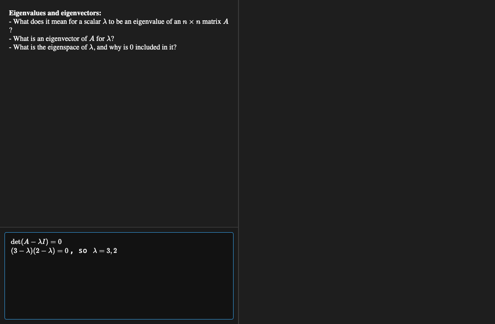
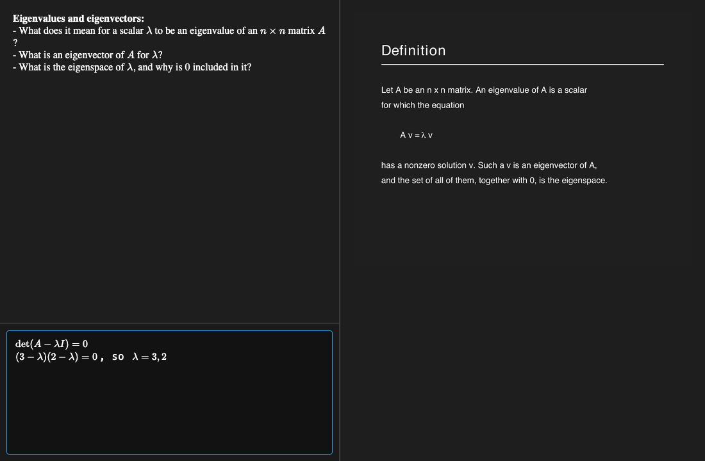

# claude2anki

Turn a PDF of lecture slides into an Anki deck you can actually study from.

Claude reads the slides, writes a question for each one, and packages everything into an `.apkg`. The front of a card holds the questions plus a scratchpad you can type LaTeX into while you think. The back is just the slide itself, so the source material stays the answer and nothing gets paraphrased into something subtly wrong.

## What a card looks like

Questions on the left, answer on the right. Under the questions is a scratchpad that takes LaTeX and renders it live, so you can work the problem out before you flip rather than just deciding whether you knew it.



Flipping fills the right pane with the slide, and your scratch work is still sitting there, so you can compare what you derived against what the lecturer wrote.



## How it works

The skill does three things in order. It reads the PDF and decides which slides carry real content, skipping title pages, tables of contents, section dividers and reference lists. It writes a `cards.json` describing each card: a topic title, a few questions, and the slides that card covers. Then `build_deck.py` rasterizes the PDF at 200 DPI, builds the notes, embeds the images and validates the result before handing you the deck.

Related slides can be merged into a single card when they cover one idea, so a 60 page deck does not necessarily become 60 cards.

## Requirements

`genanki` for packaging and `pdftoppm` (from poppler) for rasterizing.

```
pip install genanki
brew install poppler        # macOS
apt install poppler-utils   # Debian or Ubuntu
```

## Install

This repo is the skill, so installing it means putting it where Claude Code looks. Symlink rather than copy, and a `git pull` will keep the installed skill up to date.

```
git clone https://github.com/alessiopiroli/claude2anki.git
mkdir -p ~/.claude/skills
ln -s "$(pwd)/claude2anki" ~/.claude/skills/claude2anki
```

That installs it for your account, in every project. To limit it to one project instead, symlink it into that project's `.claude/skills/` directory.

Start a new Claude Code session afterwards, since skills are read at startup. You do not need to invoke it by name: ask for Anki cards from a slide PDF and Claude matches the request to the skill on its own.

To uninstall, delete the symlink. Nothing else was written.

```
rm ~/.claude/skills/claude2anki
```

## Usage

Point Claude at a slides PDF and ask for Anki cards. If you already have a `cards.json`, run the packager yourself:

```
python scripts/build_deck.py --pdf slides.pdf --cards cards.json --out deck.apkg
```

`--dpi` and `--workdir` are available if you want sharper images or a different scratch directory. The card spec format is documented in `cards.example.json`.

## License

[GPL 3.0](LICENSE). Use it, modify it, share it, teach with it, build on it. The one condition is that if you distribute a modified version it stays under the GPL, so whoever gets it from you keeps every freedom you had. Copyright 2026 Alessio Piroli.
